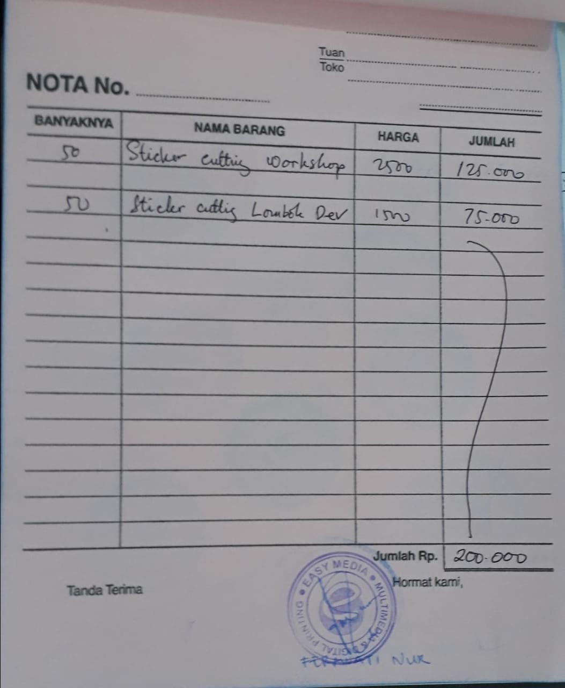
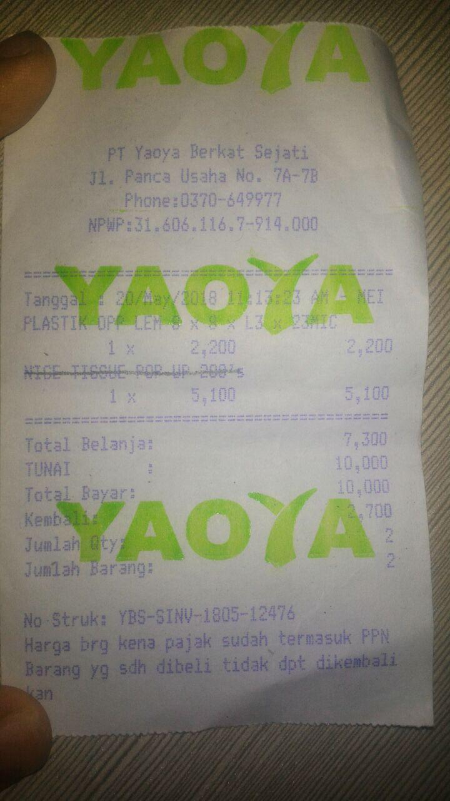
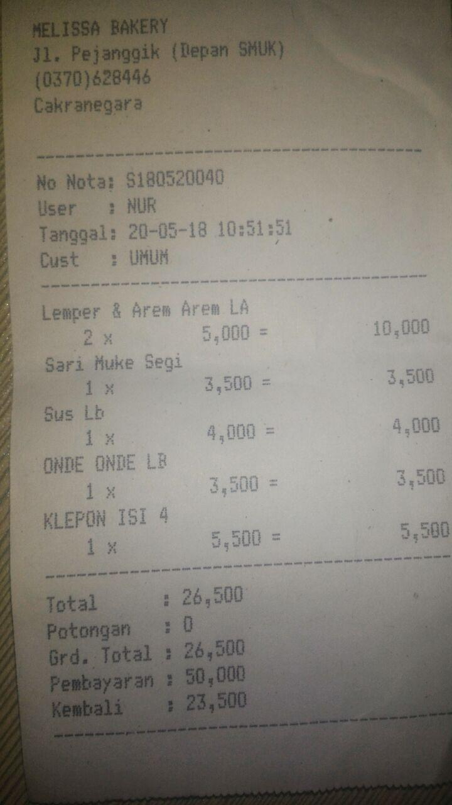
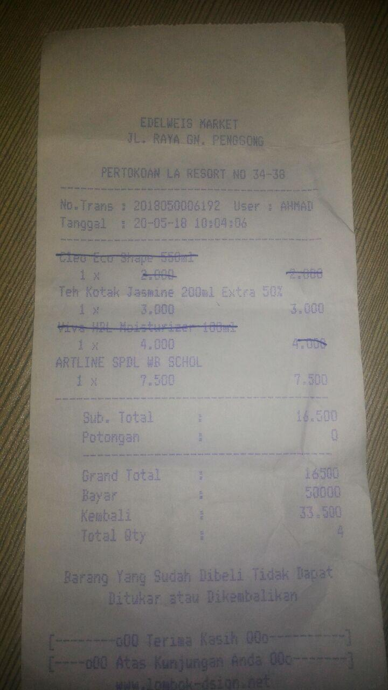

## Rincian dana masuk
 | Sumber          | Jumlah        |
 |-----------------|---------------|
 | Kas             | Rp242,000     |
 | Sumbangan       | Rp125,000     |
 | **Total**       | **Rp367,000** |
 
 ## Rincian Pengeluaran
 | Untuk                 | Dana          |
 |-----------------------|---------------|
 | Sticker               | Rp200,000     |
 | Bukber                | Rp80,000      |
 | Narmada gelas @2 kotak| Rp33,000      |
 | Plastik bungkus kurma | Rp2,000       |
 | Kue pemateri          | Rp26,500      |
 | Teh, Spidol           | Rp10,500      |
 | **Total**             | **Rp352,000** |

 ### Sticker
 

 ### Plastik bungkus kurma
 
 
 ### Kue pemateri
 

 ### Teh, spidol
 

 ### Bukber, air narmada kotak gak ada nota

 ## Sisa kas
 Rp367,000-Rp352,000 = **Rp15,000**

